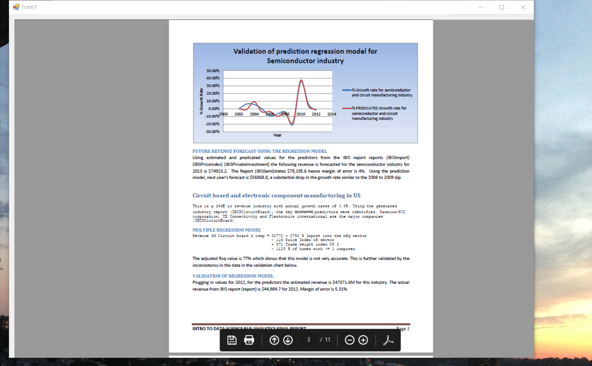

# Semiconductor Industry Analysis

The project provides an analysis on the trends in the semiconductor industry

Confidential information is not displayed.

Please download the executable for details.

All images are either custom by Alpa D Desai or a reference name is provided.

## Front page

## Executive summary

## Regression model for semiconductor industry

## Regression model circuit board and electronic manufacturing industry

## Validation of regression model for communication equipment manufacturing industry

## Industry growth analysis

## Tableau

## Regression analysis I

## Regression analysis II

## Regression analysis III

## Ethics and Integrity

Additional reference :https://github.com/alpaddesai/MergersDocumentIdea
